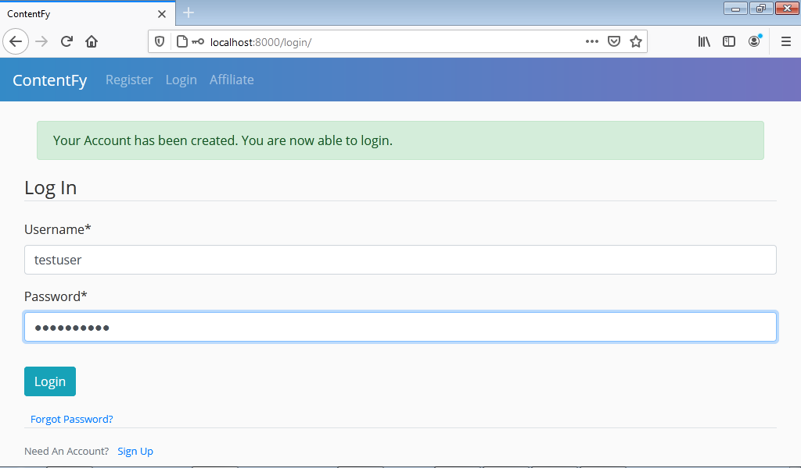
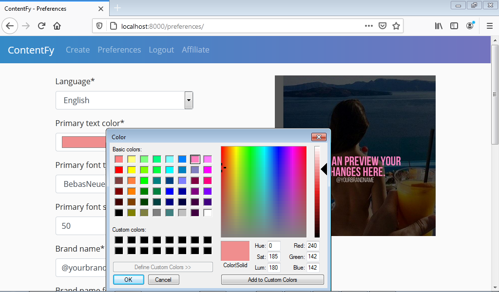
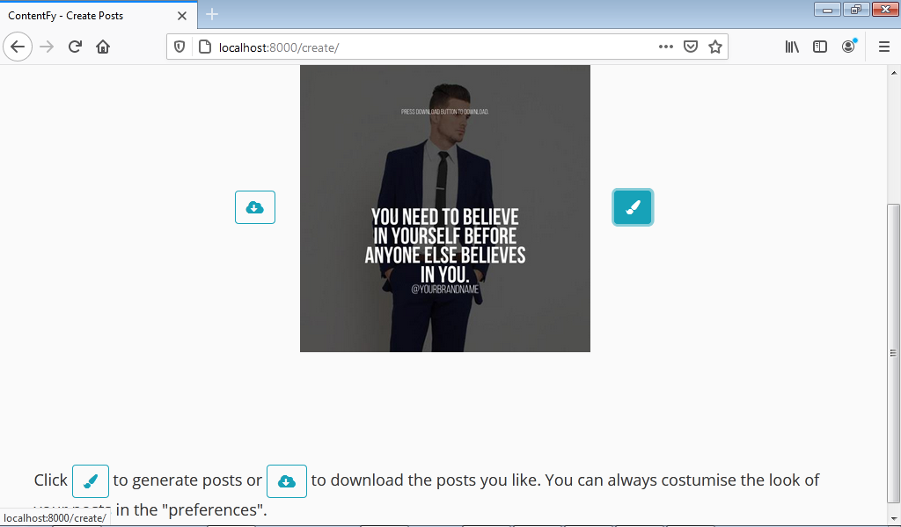
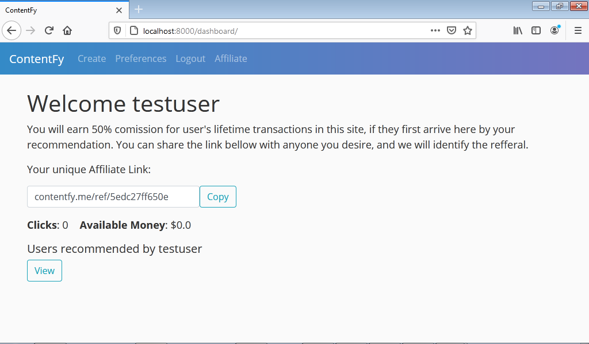

# Django Posts Generator (with screenshots)
A web application to create automated social media posts. 

It has the following features: 
* A built in photo editor (to save posts preferences);
* An affiliate system;
* A Paypal payment integration;
* Authentication

Additional Features:
* Clicks in refferal links
* Premium Features
* User statics to admin of the site

### Live Project
contentfy.me

### Screenshots












### Installation and Usage

Open cmd in the projects directory (cmd/control + Shift) and type:
```
pip install -r requirements.txt

```
Open Django_Saas/settings.py in your text editor and replace the SECRET_KEY with a 50 characters text
You can change the email backend credentials too.

then in your cmd type:
```
python manage.py runserver

```
